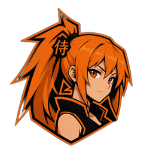

<!--
  NERV // CENTRAL DOGMA — profil de Zeleff_
  Palette : void #0d0014 · EVA purple #6b3fa0 · sync green #39ff14 · NERV orange #ff6a00 · alert red #e8001c · text #c9b6ff
-->

<div align="center">


 SYNC RATE: 400%" />


<br/><br/>


<br/>
<sub><code>▸ CAM-01 // CAGE 7 // EVA-01 — RÉVEIL CONFIRMÉ</code></sub>

</div>


<!-- ─────────────────────────────  01  ───────────────────────────── -->

### `> 01 // FICHE PILOTE`

<table>
<tr>
<td width="260" align="center" valign="middle">

<br/>
<sub><code>▸ CAM-02 // REI-00</code></sub>
</td>
<td valign="middle">

```yaml
pilote     : Zeleff_ // "the Fourth Child"
affecté    : NERV — département Dev
base       : Île de la Réunion 🌋
unité      : EVA-01 (TypeScript build)
spécialité :
  - Desktop & web : React, Electron
  - Mobile : Capacitor (Android/iOS)
  - Données : Node, Supabase
mission    : Opération NARTYA
sync_rate  : ████████████████░░ 92%
at_field   : déployé (anti-bugs)
```

</td>
</tr>
</table>


<!-- ─────────────────────────────  02  ───────────────────────────── -->

### `> 02 // OPÉRATION NARTYA`

<div align="center">

<a href="https://nartya.app"></a>

<h2>NARTYA</h2>

<b>L'anime, partout.</b> Une app de streaming d'anime pour <b>desktop, Android et iOS</b>,<br/>
pour regarder, suivre et partager ses animes au même endroit.

<br/><br/>


</div>

```diff
@@ MODULES EN SERVICE @@
+ Catalogue & lecteur vidéo HLS        + Watch party entre amis
+ Reprise, favoris & listes            + Lecture de scans
+ Profils & succès                     + Téléchargement hors ligne
```

<div align="center">

<a href="https://nartya.app"></a>
<a href="https://github.com/NartyaTeam/nartya"></a>

<br/><br/>

<a href="https://github.com/NartyaTeam/nartya"></a>
<br/>
<sub><code>▸ STACK // React · Vite · Tailwind · Zustand · Electron · Capacitor · Supabase · hls.js</code></sub>

</div>


<!-- ─────────────────────────────  03  ───────────────────────────── -->

### `> 03 // ARSENAL`

<div align="center">


<br/>

<br/>


<br/><br/>


<br/>
<sub><code>▸ CAM-03 // CATAPULTE 7 — CÂBLE OMBILICAL CONNECTÉ</code></sub>

</div>


<!-- ─────────────────────────────  04  ───────────────────────────── -->

### `> 04 // SYSTÈME MAGI`

```diff
@@ MAGI SYSTEM v3.0 :: VOTE — "Zeleff peut-il déployer Nartya en prod ?" @@
+ MELCHIOR-1  ▸  APPROVE   (les tests passent)
+ BALTHASAR-2 ▸  APPROVE   (le build Electron est vert)
- CASPER-3    ▸  REJECT    (on est vendredi soir)

! VERDICT : 2/3 — DÉPLOIEMENT AUTORISÉ. QUE DIEU NOUS VIENNE EN AIDE.
```


<!-- ─────────────────────────────  05  ───────────────────────────── -->

### `> 05 // TÉLÉMÉTRIE`

<div align="center">


<br/><br/>

<!-- Serpent généré par .github/workflows/snake.yml (branche output) -->
<picture>
  <source media="(prefers-color-scheme: dark)" srcset="https://raw.githubusercontent.com/RandomZeleff/RandomZeleff/output/eva-snake-dark.svg" />
  <source media="(prefers-color-scheme: light)" srcset="https://raw.githubusercontent.com/RandomZeleff/RandomZeleff/output/eva-snake.svg" />
  
</picture>
<br/>
<sub><code>▸ ALERTE // PATTERN BLUE — UN ANGE DÉVORE LE GRAPHE DE CONTRIBUTIONS</code></sub>

</div>


<!-- ─────────────────────────────  06  ───────────────────────────── -->

### `> 06 // CANAL DE COMMUNICATION`

<div align="center">


<br/><br/>


<br/>
<sub><code>「 逃げちゃダメだ 」 — I mustn't run away. (from my bugs.)</code></sub>


</div>
